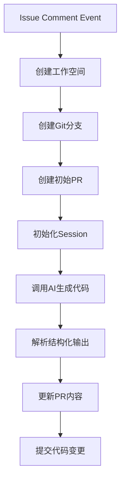

# AI-Powered Issue to PR Workflow

## 概述
该流程通过 GitHub Issue 评论触发，自动创建分支、生成代码修改并提交 PR，全程由 AI 驱动。适用于自动化代码维护场景。

## 流程图


---

## 详细步骤

### 1. 初始化阶段
| 步骤 | 操作 | 关键数据 |
|------|------|----------|
| 1.1 | 接收 GitHub Issue 评论事件 | `event *github.IssueCommentEvent` |
| 1.2 | 创建带 AI 模型信息的工作空间 | `ws := CreateWorkspaceFromIssueWithAI()` |
| 1.3 | 创建并推送 Git 分支 | `CreateBranch(ws)` |

### 2. PR 准备阶段
| 步骤 | 操作 | 关键方法 |
|------|------|----------|
| 2.1 | 创建初始 Pull Request | `CreatePullRequest(ws)` |
| 2.2 | 建立工作空间映射 | `MoveIssueToPR(ws, prNumber)` |
| 2.3 | 创建 Session 目录 | `CreateSessionPath()` |
| 2.4 | 注册工作空间 | `RegisterWorkspace(ws, pr)` |

### 3. AI 交互阶段
**Prompt 模板：**
```markdown
根据Issue修改代码：

标题：{{issue_title}}
描述：{{issue_body}}

输出格式：
### 改动摘要
简要说明改动内容

### 修改内容
- 列出修改的文件和具体变动
```

| 关键控制点 | 说明 |
|------------|------|
| 重试机制 | `promptWithRetry(ctx, code, prompt, 3)` |
| 输出解析 | `parseStructuredOutput(aiStr)` |

### 4. PR 内容生成
**PR Body 结构：**
```markdown
### 改动摘要
{{summary}}

### 修改内容
{{changes}}

### 测试计划
{{testPlan}}

---
<details><summary>AI 完整输出</summary>
{{raw_ai_output}}
</details>

<details><summary>原始 Prompt</summary>
{{original_prompt}}
</details>
```

### 5. 代码提交阶段
| 操作 | 方法 | 错误处理 |
|------|------|----------|
| 提交变更 | `CommitAndPush(ws, result, code)` | 自动回滚分支 |
| 最终状态 | 更新 PR URL 到日志 | `pr.GetHTMLURL()` |

---

## 数据结构
### Workspace 关键字段
```go
type Workspace struct {
    Path        string       // 工作目录路径
    Branch      string       // Git 分支名
    AIModel     string       // 使用的AI模型标识
    PRNumber    int          // 关联的PR编号
    SessionPath string       // Session存储路径
    PullRequest *github.PullRequest 
}
```

### ExecutionResult
```go
type ExecutionResult struct {
    Output string         // AI原始输出
    // ...其他审计字段
}
```

---

## 错误处理策略
1. **关键步骤失败**：立即终止流程并返回错误
   - 工作空间创建失败
   - 分支创建失败
   - AI 调用连续 3 次失败

2. **非关键错误**：记录后继续执行
   - 工作空间移动失败
   - 非阻塞性的文件操作错误

3. **错误信息展示**：自动在 PR Body 中标记错误段
   ```markdown
   ## 错误信息
   ```text
   {{error_details}}
   ```
   ```

---

## 扩展能力
1. **多模型支持**：通过 `aiModel` 参数指定不同 AI 引擎
2. **自定义 Prompt**：可通过 `args` 注入额外指令
3. **审计追踪**：保留完整的 AI 交互记录在 PR 中

